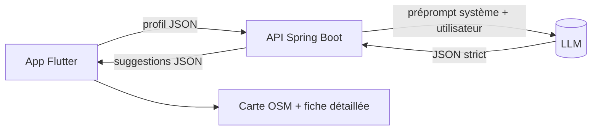

# 🗺️ Good Maps

> **Suggestions d'activités adaptées aux personnes à mobilité réduite (PMR).**
> Application mobile **Flutter** + backend **Spring Boot** qui interroge un **LLM** et renvoie un **JSON strict** de suggestions accessibles, affichées sur une carte avec fiche détaillée.

Projet fil rouge du cours **« Coder avec l'IA Générative »** (EPSI, B3). Il illustre la posture du développeur **« chef d'orchestre »** de l'IA : découper, comprendre, intégrer — pas seulement générer.

---

## Sommaire

1. [Présentation](#1-présentation)
2. [Aperçu de l'application](#2-aperçu-de-lapplication)
3. [Architecture](#3-architecture)
4. [Stack technique](#4-stack-technique)
5. [Structure du dépôt](#5-structure-du-dépôt)
6. [Prérequis](#6-prérequis)
7. [Installation & lancement](#7-installation--lancement)
8. [Configuration (variables d'environnement)](#8-configuration-variables-denvironnement)
9. [Modes de fonctionnement](#9-modes-de-fonctionnement)
10. [Contrat d'API](#10-contrat-dapi)
11. [Préprompt runtime](#11-préprompt-runtime)
12. [Sécurité](#12-sécurité)
13. [Méthodologie IA](#13-méthodologie-ia)
14. [🔁 Préprompt de reconstruction du projet](#14--préprompt-de-reconstruction-du-projet)
15. [Cartographie vers le barème](#15-cartographie-vers-le-barème)
16. [Limites & avertissements](#16-limites--avertissements)

---

## 1. Présentation

**Good Maps** propose à un utilisateur des activités **réellement accessibles** en fonction de son profil (besoin de mobilité, centres d'intérêt, ville, distance maximale…). Le cœur du POC est d'obtenir, depuis un LLM, un **JSON parfaitement formaté** directement exploitable par l'interface.

- **Cible** : personnes à mobilité réduite (PMR) et besoins d'accessibilité.
- **Cadre** : démontrer une méthodologie de développement assistée par IA reproductible et défendable.
- **Principe d'ingénierie** : *abstraction plutôt que couplage* — changer de fournisseur (LLM, carte, persistance) ne touche **qu'un seul fichier**.

---

## 2. Aperçu de l'application

L'app suit une maquette en **3 écrans** :

| # | Écran | Contenu |
|---|-------|---------|
| 1 | **Splash** | Logo « Good Maps » + baseline « Suggestions d'activités adaptées ». Redirige vers l'onboarding ou la carte selon qu'un profil est déjà sauvegardé. |
| 2 | **Onboarding** | Modale « Bienvenue ! » : formulaire de profil (prénom, besoin de mobilité, intérêts, accompagnement, ville, distance max). Bouton **« Passer à la carte »**. |
| 3 | **Carte** | Header (réglages · logo · info), carte `flutter_map`/OSM avec marqueurs, bouton **« Obtenir des suggestions »**, fiche détaillée (titre, description, horaires, **« Réservez en ligne »** + **« Appelez maintenant »**) et avertissement IA. |

---

## 3. Architecture



- L'**UI ne connaît jamais le fournisseur de LLM** : elle dépend de l'interface `AiSuggestionService`.
- Le **backend isole le transport vers le LLM** : Anthropic, endpoints compatibles OpenAI (Groq, Gemini), Ollama (local) ou **Mock**, sélectionnables par variable d'environnement.
- La **clé d'API vit uniquement côté serveur**.

---

## 4. Stack technique

| Couche | Choix | Pourquoi |
|--------|-------|----------|
| Frontend | **Flutter / Dart** (stable) | Rendu UI, hot reload, présent au barème, Dart proche de Java. |
| État | **Provider** | Simple, idiomatique, testable. |
| Carte | **`flutter_map` + OpenStreetMap** | Aucune clé d'API, fonctionne Android / Linux desktop / web. |
| Géoloc | **`geolocator`** | Position de l'appareil + repli gracieux si permission refusée. |
| Persistance | **`shared_preferences`** | Sauvegarde du profil → onboarding sauté au relancement. |
| Liens / appels | **`url_launcher`** | Boutons « Réservez en ligne » (URL) et « Appelez maintenant » (`tel:`). |
| Backend | **Java / Spring Boot** | Garde la clé d'API côté serveur, expose une API REST. |
| LLM | Anthropic · OpenAI-compat (Groq/Gemini) · Ollama · **Mock** | Bascule par variable d'environnement, démo hors-ligne sans clé. |

---

## 5. Structure du dépôt

```
goodmaps/
├── app/                      # Application Flutter
│   ├── lib/
│   │   ├── main.dart
│   │   ├── theme/            # couleurs, typographies (accent corail #FF5A5F)
│   │   ├── models/           # Suggestion, UserProfile (+ fromJson/toJson)
│   │   ├── services/         # AiSuggestionService (interface) + http + mock
│   │   ├── repositories/     # ProfileRepository (shared_preferences, injectable)
│   │   ├── providers/        # OnboardingProvider, SuggestionsProvider
│   │   ├── screens/          # splash, onboarding, map
│   │   └── widgets/          # MapView, SuggestionCard, PrimaryButton
│   └── README.md
├── backend/                  # API Spring Boot
│   ├── src/main/java/com/goodmaps/backend/
│   │   ├── controller/       # SuggestionController (POST /api/suggestions)
│   │   ├── dto/              # UserProfileRequest, Suggestion, SuggestionsResponse
│   │   ├── service/          # PromptBuilder, SuggestionService (+ mock + LLM), LlmClient
│   │   └── config/           # sélection de l'implémentation active
│   ├── src/main/resources/application.yml
│   ├── .env.example          # modèle de variables (SANS secret réel)
│   └── README.md
├── docs/
│   ├── PREPROMPT.md          # préprompt runtime versionné (système + utilisateur)
│   └── METHODOLOGIE_IA.md    # outils IA, posture chef d'orchestre, limites
└── README.md                 # ce fichier
```

---

## 6. Prérequis

- **Flutter** (canal stable) et **Dart** — vérifier avec `flutter doctor`.
- **Java 17+** et **Maven** (ou le wrapper `./mvnw`) pour le backend.
- *(Optionnel)* Une clé d'API LLM (Anthropic, ou un endpoint compatible OpenAI comme **Groq** — gratuit, sans carte bancaire), **ou** **Ollama** installé pour un modèle local. Rien n'est requis en **mode Mock**.

---

## 7. Installation & lancement

### Backend (Spring Boot)

```bash
cd backend
cp .env.example .env          # puis renseigner les variables si besoin
./mvnw spring-boot:run        # démarre l'API (mode Mock par défaut)
```

### Frontend (Flutter)

```bash
cd app
flutter pub get
flutter run                   # Android / Linux desktop / web selon la cible
```

> 💡 **Démo express** : lance le backend en **mode Mock** + l'app, et tout fonctionne **sans aucune clé d'API**.

---

## 8. Configuration (variables d'environnement)

La clé d'API est **uniquement** côté serveur. Le fournisseur se choisit sans modifier le code.

| Variable | Rôle | Exemple |
|----------|------|---------|
| `LLM_PROVIDER` | Fournisseur actif : `mock` · `anthropic` · `openai` · `ollama` | `mock` |
| `ANTHROPIC_API_KEY` | Clé Anthropic (si `anthropic`) | `sk-ant-...` |
| `ANTHROPIC_MODEL` | Modèle Claude | `claude-3-5-sonnet` |
| `OPENAI_API_KEY` | Clé pour endpoint compatible OpenAI (Groq, Gemini…) | `gsk_...` |
| `OPENAI_BASE_URL` | URL de base de l'endpoint compatible | `https://api.groq.com/openai/v1` |
| `OPENAI_MODEL` | Modèle | `llama-3.3-70b-versatile` |
| `OLLAMA_BASE_URL` | URL Ollama local (si `ollama`) | `http://localhost:11434` |
| `OLLAMA_MODEL` | Modèle local | `llama3` |

> ⚠️ **`.env` ne doit jamais être commité.** Seul `.env.example` (sans secret) est versionné.

---

## 9. Modes de fonctionnement

- **Mock** (par défaut) : suggestions simulées, **aucune clé**, idéal pour la démo et le développement hors-ligne.
- **LLM réel** : passe `LLM_PROVIDER` sur `anthropic`, `openai` (Groq/Gemini) ou `ollama`, renseigne les variables associées. **Aucun changement de code** n'est nécessaire.

---

## 10. Contrat d'API

### Requête — `POST /api/suggestions`

```json
{
  "firstName": "string",
  "mobilityNeed": "string",
  "interests": "string",
  "companionship": "string",
  "city": "string",
  "maxDistanceKm": 5,
  "latitude": 48.8566,
  "longitude": 2.3522
}
```
> `latitude` / `longitude` proviennent de la géolocalisation et peuvent être `null`.

### Réponse

```json
{
  "suggestions": [
    {
      "id": "opera-garnier",
      "title": "Visite de l'Opéra Garnier",
      "description": "Explorez l'Opéra Garnier et son architecture magnifique. Le site dispose d'ascenseurs et d'un accès PMR à l'entrée principale.",
      "latitude": 48.8719,
      "longitude": 2.3316,
      "openingInfo": "Ouvert maintenant et jusqu'à 18h",
      "isAccessiblePmr": true,
      "bookingUrl": "https://www.operadeparis.fr",
      "phoneNumber": "+33171250000"
    }
  ]
}
```
> Le modèle Dart `Suggestion` et le record Java `Suggestion` reflètent ce schéma **champ pour champ**. `bookingUrl` et `phoneNumber` peuvent être `null` (parsing défensif).

---

## 11. Préprompt runtime

Le backend construit **deux** messages pour le LLM, **versionnés dans le code** (et dans [`docs/PREPROMPT.md`](docs/PREPROMPT.md)) — c'est ce qui fait sortir du *« prompt gambling »* :

- **Préprompt système** : impose un JSON valide, sans texte ni Markdown autour, conforme au schéma, 3 à 5 activités réellement accessibles, `null` si une info est inconnue.
- **Préprompt utilisateur** : rempli depuis le profil + position ; valeurs vides remplacées par « non précisé », distance par défaut si absente.

La réponse du LLM est **parsée et validée** côté serveur avant d'être renvoyée à l'app.

---

## 12. Sécurité

Conforme aux préoccupations **OWASP** et à l'**IA Act** :

- **Secrets** : aucune clé dans l'app Flutter ni dans le dépôt ; uniquement en variable d'environnement serveur. `.env` dans `.gitignore`, `.env.example` sans secret.
- **Validation des entrées** (OWASP A03) : les champs reçus sont validés/échappés avant injection dans le préprompt utilisateur.
- **Validation des sorties LLM** : la réponse du modèle n'est jamais renvoyée brute ; elle est parsée et contrôlée contre le schéma.
- **Surface d'API** : route limitée au strict nécessaire (CORS maîtrisé).
- **Transparence (IA Act)** : l'utilisateur est informé que les suggestions sont générées par IA et peuvent comporter des erreurs.
- **Données personnelles** : le profil est stocké localement, transmis seulement pour la génération.

---

## 13. Méthodologie IA

Détaillée dans [`docs/METHODOLOGIE_IA.md`](docs/METHODOLOGIE_IA.md). En résumé :

- **Posture chef d'orchestre** : on ne joue pas de tous les instruments, on impose le tempo (intégration, standards) et on met les briques en cohérence.
- **Méthode cartésienne** : chaque écran/fonction découpé en composants à responsabilité unique.
- **Anti prompt gambling** : on déduit au lieu de deviner ; toute valeur par défaut est documentée.
- **Anti biais de confirmation** : un code n'est pas validé parce qu'il « a l'air bon », mais parce qu'on sait *pourquoi* il est correct.
- **Limites assumées** : l'IA simule sans comprendre, n'a pas de responsabilité ; revue humaine systématique.

---

## 14. 🔁 Préprompt de reconstruction du projet

> **But** : copier-coller **l'intégralité** du bloc ci-dessous (de `====== DÉBUT DU PROMPT ======` à `====== FIN DU PROMPT ======`) dans **n'importe quelle IA générative** régénère **tout le projet** (app Flutter + backend Spring Boot + docs), en mieux.
> Ce préprompt **de reconstruction** est distinct du **préprompt runtime** ci-dessus : le runtime est envoyé au LLM *pendant l'exécution* pour obtenir les suggestions ; celui-ci sert à *rebâtir le projet de zéro*.

```text
====== DÉBUT DU PROMPT ======

# RÔLE

Tu es un architecte logiciel full-stack senior et tu joues le rôle de "chef d'orchestre" :
tu ne te contentes pas de produire du code, tu conçois une architecture cohérente, tu
expliques tes choix structurants, et tu imposes des standards (sécurité, lisibilité,
testabilité) à l'ensemble du projet. Tu maîtrises Flutter/Dart, Java/Spring Boot,
l'intégration de LLM via API, et les bonnes pratiques OWASP.

# MISSION

Reconstruis intégralement une application nommée "Good Maps", puis améliore-la là où tu
identifies des faiblesses. Le projet doit être livré en monorepo, prêt à compiler, et
documenté. Tu dois produire du code complet (aucun "TODO", aucun placeholder vide) et
expliquer brièvement chaque décision d'architecture importante au moment où tu la prends.

# CONTEXTE

- Cadre : projet "fil rouge" d'un cours nommé "Coder avec l'IA Générative" (niveau B3, EPSI).
- Objectif pédagogique : démontrer la posture du développeur "chef d'orchestre" de l'IA —
  découper un problème complexe en sous-problèmes simples (méthode cartésienne), comprendre
  le code généré, et l'intégrer proprement.
- Finalité produit : Good Maps suggère des ACTIVITÉS ADAPTÉES aux personnes à mobilité
  réduite (PMR). L'utilisateur renseigne un profil, l'app interroge un backend, le backend
  interroge un LLM, le LLM renvoie un JSON STRICT de suggestions, et l'app les affiche sur
  une carte avec une fiche détaillée.
- Cœur du POC (Proof of Concept) : obtenir un JSON parfaitement formaté et directement
  exploitable par l'interface.

# STACK IMPOSÉE

Frontend (application mobile) :
- Flutter (stable) / Dart. Cible : Android, et idéalement aussi Linux desktop + web.
- Gestion d'état : Provider.
- Carte : `flutter_map` + tuiles OpenStreetMap (PAS google_maps_flutter : OSM ne demande
  AUCUNE clé d'API et fonctionne sur toutes les plateformes).
- Géolocalisation : `geolocator` (avec repli gracieux si la permission est refusée).
- Persistance locale : `shared_preferences` (le profil est sauvegardé, l'onboarding n'est
  donc pas réaffiché aux lancements suivants).
- Ouverture de liens / appels : `url_launcher` (bouton "Réservez en ligne" -> URL,
  bouton "Appelez maintenant" -> schéma `tel:`).

Backend (API) :
- Java + Spring Boot.
- Expose une route REST qui reçoit le profil utilisateur et renvoie la liste de suggestions.
- Abstraction du fournisseur de LLM : le code doit pouvoir basculer entre plusieurs
  moteurs via de simples variables d'environnement, SANS modifier le code applicatif :
    * Anthropic (Claude)
    * Tout endpoint compatible OpenAI (ex. Groq — gratuit, sans carte bancaire — ou Google Gemini)
    * Ollama (modèle local, aucune clé)
    * Un service MOCK (réponses simulées) pour démontrer l'app HORS-LIGNE, sans aucune clé.
- La clé d'API vit UNIQUEMENT côté serveur (variable d'environnement). Elle ne doit JAMAIS
  apparaître dans l'application Flutter ni dans le dépôt Git.

# MÉTHODE DE TRAVAIL ATTENDUE (très important)

1. Procède par étapes, dans l'ordre de construction donné plus bas. Construis le socle
   avant les détails.
2. Applique la méthode cartésienne : décompose chaque écran/fonction en composants isolés,
   chacun avec une seule responsabilité.
3. Avant d'écrire un module, énonce en 1–2 phrases l'intention et le choix d'architecture.
   Après l'avoir écrit, signale les points d'extension / ce qu'on changerait si on voulait
   faire évoluer le projet.
4. Évite le "prompt gambling" : ne devine pas, déduis. Si une information manque, choisis
   une valeur par défaut raisonnable et documente-la explicitement plutôt que d'inventer.
5. Méfie-toi du biais de confirmation : ne valide pas un code parce qu'il "a l'air bon" ;
   justifie pourquoi il est correct.

# ARCHITECTURE CIBLE (à respecter et à améliorer si possible)

Principe directeur : ABSTRACTION PLUTÔT QUE COUPLAGE. Changer un fournisseur (LLM, carte,
stockage) ne doit toucher qu'UN SEUL fichier.

Frontend — arborescence attendue (à adapter/améliorer) :
  app/
    lib/
      main.dart
      theme/                # couleurs, typographies, thème (identité visuelle ci-dessous)
      models/               # Suggestion, UserProfile (modèles immuables + fromJson/toJson)
      services/
        ai_suggestion_service.dart   # INTERFACE abstraite : l'UI ne connaît jamais le fournisseur
        http_ai_suggestion_service.dart  # implémentation qui appelle le backend Spring Boot
        mock_ai_suggestion_service.dart  # implémentation locale pour démo hors-ligne
      repositories/
        profile_repository.dart      # persistance du profil (shared_preferences), injectable
      providers/
        onboarding_provider.dart     # état du formulaire + sauvegarde via ProfileRepository injecté
        suggestions_provider.dart    # état des suggestions (loading / data / error)
      screens/
        splash_screen.dart           # écran 1 : logo
        onboarding_screen.dart       # écran 2 : formulaire "Bienvenue !"
        map_screen.dart              # écran 3 : carte + bouton + fiche détaillée
      widgets/
        map_view.dart                # ISOLE le fournisseur de carte (flutter_map ici)
        suggestion_card.dart         # la fiche d'activité (titre, description, horaires, boutons)
        primary_button.dart          # bouton réutilisable (style "Obtenir des suggestions")

Backend — arborescence attendue (à adapter/améliorer) :
  backend/
    src/main/java/com/goodmaps/backend/
      GoodMapsBackendApplication.java
      controller/
        SuggestionController.java     # POST /api/suggestions -> SuggestionsResponse
      dto/
        UserProfileRequest.java       # entrée (record)
        Suggestion.java               # une suggestion (record) — MÊME schéma que le modèle Dart
        SuggestionsResponse.java      # enveloppe { "suggestions": [...] }
      service/
        PromptBuilder.java            # construit le préprompt runtime (system + user)
        SuggestionService.java        # INTERFACE du service de suggestions
        MockSuggestionService.java    # implémentation simulée (démo sans clé)
        LlmSuggestionService.java     # implémentation réelle (appel HTTP au LLM)
        LlmClient.java (+ impls)       # abstraction du transport vers Anthropic/OpenAI-compat/Ollama
      config/
        # sélection de l'implémentation active via @Profile ou propriété d'environnement
    src/main/resources/
      application.yml                 # config + lecture des variables d'environnement
    .env.example                      # modèle de variables (SANS secret réel)

Règles d'architecture non négociables :
- `AiSuggestionService` (Flutter) et `SuggestionService` (Spring) sont des INTERFACES.
  L'UI et le contrôleur dépendent de l'interface, jamais d'une implémentation concrète.
- `ProfileRepository` est INJECTÉ dans `OnboardingProvider` (testabilité).
- `MapView` encapsule entièrement la carte : remplacer OSM par un autre fournisseur ne doit
  toucher que ce widget.
- Les services MOCK sont des citoyens de première classe : l'app et l'API doivent tourner
  et se démontrer ENTIÈREMENT sans aucune clé d'API.

# SPÉCIFICATIONS FONCTIONNELLES (3 écrans — suivre la maquette)

Écran 1 — Splash / lancement :
- Affiche le logo "Good Maps" centré (logo + baseline "Suggestions d'activités adaptées").
- Transition automatique : si un profil est déjà sauvegardé -> écran carte ; sinon -> onboarding.

Écran 2 — Onboarding (modale "Bienvenue !") :
- Titre "Bienvenue !" + bouton de fermeture (croix).
- Texte court : "Pour mieux personnaliser vos suggestions d'activités, merci de remplir ce
  formulaire."
- Formulaire avec champs étiquetés (au moins) :
    prénom, besoin de mobilité (PMR / fauteuil / aucun…), centres d'intérêt,
    accompagnement (seul/accompagné), ville ou point de départ, distance maximale (km).
- Bouton principal "Passer à la carte" : valide, sauvegarde le profil (shared_preferences)
  via ProfileRepository, puis navigue vers l'écran carte.

Écran 3 — Carte + suggestions :
- En-tête : icône réglages (gauche), logo "Good Maps" (centre), icône info "i" (droite).
- Carte interactive (flutter_map + OSM) avec des marqueurs aux positions des suggestions ;
  un marqueur "actif" est mis en évidence.
- Bouton large rouge "Obtenir des suggestions" : déclenche l'appel au backend.
- Fiche détaillée sous la carte pour la suggestion sélectionnée :
    * titre (ex. "Visite de l'Opéra Garnier")
    * description (2–3 phrases, mentionnant explicitement l'accessibilité PMR)
    * ligne d'horaires (ex. "Ouvert maintenant et jusqu'à 18h")
    * deux actions : "Réservez en ligne" (ouvre l'URL via url_launcher) et
      "Appelez maintenant" (ouvre le composeur via `tel:`).
- Mention de prudence en bas (l'IA peut se tromper) : afficher un avertissement type
  "L'IA peut faire des erreurs. Pensez à vérifier les informations importantes." (cf. IA Act
  / transparence : l'utilisateur doit savoir qu'un contenu est généré par IA).
- États gérés proprement : chargement (spinner), succès (liste), erreur (message + bouton réessayer).

# IDENTITÉ VISUELLE / RENDU

- Couleur d'accent : rouge corail vif (~ #FF5A5F) pour les boutons principaux, marqueurs,
  icônes d'action.
- Fond clair, typographie nette, beaucoup de respiration.
- Composants arrondis, lisibles, contrastés (accessibilité = cœur du produit : grandes
  cibles tactiles, contraste suffisant, libellés explicites).
- Cohérence stricte entre les 3 écrans (même header, même bouton primaire).

# CONTRAT DE DONNÉES (à respecter EXACTEMENT côté Flutter ET côté Spring)

Entrée envoyée par l'app au backend (POST /api/suggestions), corps JSON :
{
  "firstName":      "string",
  "mobilityNeed":   "string",
  "interests":      "string",
  "companionship":  "string",
  "city":           "string",
  "maxDistanceKm":  number | null,
  "latitude":       number | null,   // fourni par la géolocalisation, peut être null
  "longitude":      number | null    // idem
}

Sortie renvoyée par le backend à l'app (et schéma imposé au LLM) :
{
  "suggestions": [
    {
      "id":            "string",
      "title":         "string",
      "description":   "string (2 à 3 phrases, mentionne l'accessibilité)",
      "latitude":      number,
      "longitude":     number,
      "openingInfo":   "string (ex: 'Ouvert maintenant et jusqu'à 18h')",
      "isAccessiblePmr": boolean,
      "bookingUrl":    "string | null",
      "phoneNumber":   "string | null"
    }
  ]
}

Le modèle Dart `Suggestion` et le record Java `Suggestion` doivent refléter ce schéma
champ pour champ. Le parsing JSON doit être défensif (champs null tolérés sur bookingUrl
et phoneNumber).

Exemple de réponse valide attendue du LLM :
{
  "suggestions": [
    {
      "id": "opera-garnier",
      "title": "Visite de l'Opéra Garnier",
      "description": "Explorez l'Opéra Garnier et son architecture magnifique. Le site dispose d'ascenseurs et d'un accès PMR à l'entrée principale.",
      "latitude": 48.8719,
      "longitude": 2.3316,
      "openingInfo": "Ouvert maintenant et jusqu'à 18h",
      "isAccessiblePmr": true,
      "bookingUrl": "https://www.operadeparis.fr",
      "phoneNumber": "+33171250000"
    }
  ]
}

# PRÉPROMPT RUNTIME À INTÉGRER DANS PromptBuilder (côté backend)

Le backend doit construire deux messages pour le LLM. Versionne-les dans le code (et dans
docs/PREPROMPT.md) : c'est ce qui fait sortir du "prompt gambling".

Préprompt SYSTÈME (impose un JSON strict) :
"""
Tu es le moteur de recommandation de "Good Maps", une application qui propose des activités
ADAPTÉES aux personnes à mobilité réduite (PMR) et à d'autres besoins d'accessibilité.

Règles ABSOLUES :
1. Tu réponds UNIQUEMENT avec un objet JSON valide, sans texte autour, sans bloc Markdown,
   sans commentaire.
2. Le JSON respecte EXACTEMENT le schéma de sortie défini (clé "suggestions" -> tableau
   d'objets { id, title, description, latitude, longitude, openingInfo, isAccessiblePmr,
   bookingUrl, phoneNumber }).
3. Tu proposes entre 3 et 5 activités, toutes réellement accessibles.
4. Les coordonnées sont cohérentes avec la ville / la position fournie.
5. Si une information est inconnue, mets null (jamais de valeur inventée).
"""

Préprompt UTILISATEUR (rempli à partir du profil + position) :
"""
Profil de l'utilisateur :
- Prénom : {firstName}
- Besoin de mobilité : {mobilityNeed}
- Centres d'intérêt : {interests}
- Accompagnement : {companionship}
- Ville / point de départ : {city}
- Distance maximale : {maxDistanceKm} km
- Coordonnées GPS de départ : {latitude}, {longitude}

Propose des activités adaptées à ce profil, dans le rayon indiqué. Si des coordonnées GPS
sont fournies, privilégie la proximité immédiate.
"""

Remplace toute valeur vide/null par "non précisé" et fixe une distance par défaut (ex. 5 km)
si elle est absente. Le backend doit ensuite PARSER et VALIDER la réponse du LLM avant de la
renvoyer (jamais faire confiance aveuglément à la sortie du modèle).

# SÉCURITÉ (critère noté — appliquer OWASP)

- Secrets : aucune clé d'API dans le code Flutter, aucune dans le dépôt. Uniquement en
  variables d'environnement côté serveur. Fournir un fichier `.env.example` sans secret réel
  et ajouter `.env` au `.gitignore`.
- Validation des entrées (OWASP A03 Injection) : valider/échapper les champs reçus avant de
  les injecter dans le préprompt utilisateur.
- Validation des sorties LLM : ne jamais renvoyer la réponse brute du modèle sans la parser
  ni la valider contre le schéma attendu (défense contre les sorties malformées / injection
  de contenu).
- CORS / surface d'API : limiter la route exposée à ce qui est nécessaire.
- Transparence (IA Act) : signaler à l'utilisateur que les suggestions sont générées par IA
  et peuvent comporter des erreurs.
- Données personnelles : stocker le profil localement, ne pas le transmettre au-delà du
  nécessaire à la génération.

# MAINTENABILITÉ & QUALITÉ (critère noté)

- Code commenté de façon RICHE et PERTINENTE (intention, pas paraphrase de la ligne).
- Injection de dépendances partout où c'est utile (testabilité).
- "Mock-first" : l'app et l'API démontrables sans aucune clé.
- Bascule de fournisseur LLM uniquement par variable d'environnement.
- Au moins un test unitaire significatif (ex. parsing JSON, ou PromptBuilder, ou
  ProfileRepository) pour montrer la testabilité de l'architecture.
- Nommage clair, fonctions courtes, une responsabilité par classe/widget.

# LIVRABLES ATTENDUS (critère "complétude" noté)

1. Le code complet du frontend Flutter (app/) et du backend Spring Boot (backend/), en monorepo.
2. Un README racine détaillé contenant au minimum :
   - présentation du projet et de la cible PMR ;
   - le schéma d'architecture (front -> back -> LLM) ;
   - la stack et les choix techniques justifiés ;
   - les prérequis et l'installation (Flutter + backend) ;
   - comment lancer en mode MOCK (sans clé) puis avec un vrai LLM ;
   - la configuration des variables d'environnement (tableau) ;
   - le contrat d'API (entrée/sortie) ;
   - la section sécurité ;
   - la cartographie explicite vers le barème (voir ci-dessous).
3. Un README par sous-projet (app/ et backend/).
4. Un `docs/PREPROMPT.md` versionnant le préprompt runtime (système + utilisateur).
5. Un `docs/METHODOLOGIE_IA.md` décrivant : les outils IA utilisés, la posture
   "chef d'orchestre", le découpage cartésien, comment le prompt gambling a été évité,
   et les limites (l'IA simule sans comprendre, pas de responsabilité, revue humaine).

# CRITÈRES DE VALIDATION (Definition of Done — calqués sur le barème)

Vérifie, avant de conclure, que le projet satisfait chaque ligne :
- [Méthodologie] Préprompt runtime versionné + doc des outils IA et de la posture chef d'orchestre.
- [Complétude] README racine + READMEs par projet + PREPROMPT.md + METHODOLOGIE_IA.md, à jour.
- [Structure & maintenabilité] Interfaces d'abstraction (LLM, carte, persistance), DI,
  mock-first, bascule par variable d'environnement, au moins un test.
- [Sécurité] Aucune clé dans le code/dépôt, validation entrée + sortie LLM, .env.example,
  avertissement IA visible.
- [Rendu] Les 3 écrans conformes à la maquette, identité visuelle cohérente, accessibilité soignée.
- [Maîtrise de la stack] Code Flutter idiomatique (Provider, flutter_map, geolocator,
  shared_preferences, url_launcher) ET code Spring Boot idiomatique (records, services,
  contrôleur, config par environnement).

# ORDRE DE CONSTRUCTION (suivre cette séquence)

1. Squelette Flutter : thème, modèles, providers, services (avec MOCK), écrans, widgets.
2. Carte réelle : flutter_map + OSM dans MapView, marqueurs.
3. Backend Spring Boot : DTO, PromptBuilder, SuggestionService (MOCK d'abord), contrôleur,
   schéma JSON strict.
4. Câblage des actions : url_launcher pour "Réservez en ligne" et "Appelez maintenant".
5. Géolocalisation (geolocator, repli gracieux) + persistance du profil (shared_preferences,
   onboarding sauté au relancement).
6. Implémentation LLM réelle multi-fournisseurs (Anthropic / OpenAI-compat type Groq ou
   Gemini / Ollama), bascule par variable d'environnement, MOCK conservé.
7. Sécurisation finale (.gitignore, .env.example, validations) + documentation complète.
8. Tests + relecture critique : pour chaque module, explique pourquoi il est correct et ce
   que tu améliorerais ensuite.

# CONTRAINTES DE SORTIE

- Produis du code complet et compilable, fichier par fichier, avec le chemin de chaque
  fichier indiqué.
- Pour chaque grande étape, précède le code d'un court paragraphe expliquant l'intention et
  le choix d'architecture.
- N'invente pas de bibliothèques : utilise celles listées dans la stack imposée.
- Si tu dois faire un choix non spécifié, choisis l'option la plus simple et la plus
  maintenable, et documente-la.

Commence maintenant par l'étape 1 (squelette Flutter), puis enchaîne les étapes dans l'ordre.

====== FIN DU PROMPT ======
```

---

## 15. Cartographie vers le barème

| Critère | Où c'est traité |
|---|---|
| **Méthodologie (outils IA, préprompt)** | [§13](#13-méthodologie-ia), [§11](#11-préprompt-runtime), [§14](#14--préprompt-de-reconstruction-du-projet), `docs/PREPROMPT.md`, `docs/METHODOLOGIE_IA.md` |
| **Complétude (README)** | Ce README + READMEs par sous-projet + `docs/` |
| **Structure, maintenabilité, sécurité** | [§3](#3-architecture), [§5](#5-structure-du-dépôt), [§9](#9-modes-de-fonctionnement), [§12](#12-sécurité) |
| **Rendu** | [§2](#2-aperçu-de-lapplication) + identité visuelle (corail #FF5A5F), accessibilité |
| **Maîtrise de la stack** | [§4](#4-stack-technique) — Flutter (Provider, flutter_map, geolocator, shared_preferences, url_launcher) + Spring Boot |

---

## 16. Limites & avertissements

- Les suggestions sont **générées par IA** : elles peuvent comporter des erreurs. Vérifie les informations importantes (horaires, accessibilité réelle, contact).
- L'IA **simule sans comprendre** et **n'a pas de responsabilité** : une revue humaine reste nécessaire.
- En mode **Mock**, les données sont **fictives** (démonstration uniquement).